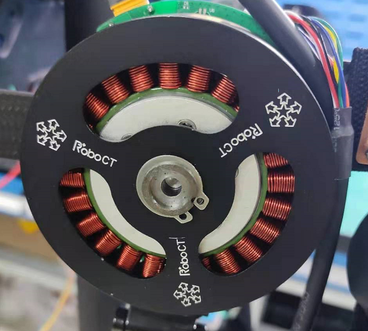
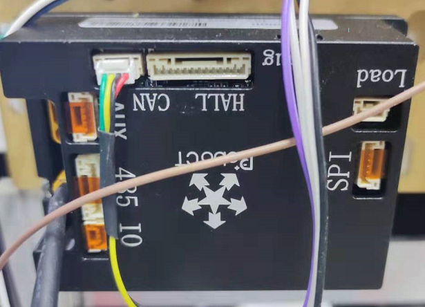

### Hardware

* *Chen Tian* motor on each hip joint + motor driver with CAN interface **(CAN1)**

    

* IMU on each thigh with USART interface **(USART4 and 5)**

 

* 24V battery

 

* back wearing structure

* human-machine interaction FSR **(ADC 1)**

   

* micro-chip STM32F103RET6  PCB DIY

   

 

